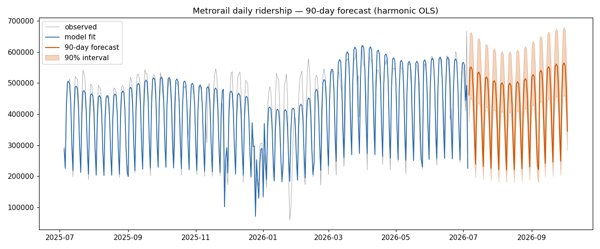
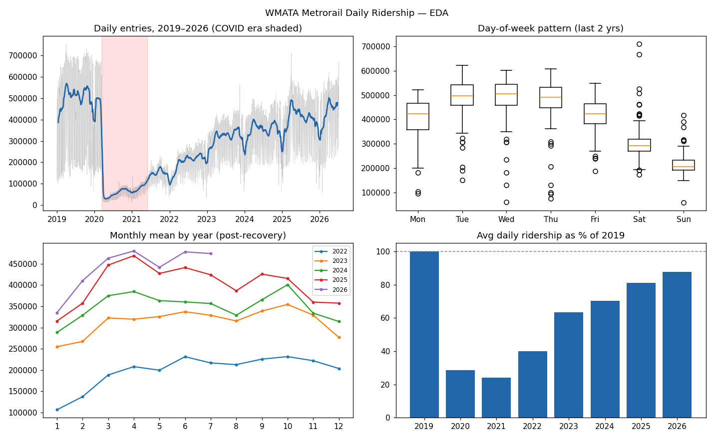

# Forecasting DC Metro Ridership

Time-series forecasting of WMATA Metrorail daily ridership in Python —
seasonality decomposition, holiday effects, and model comparison with
rolling-origin cross-validation, framed as a transit budget-planning problem.

**Author:** Ian S. Huber · [Portfolio](https://isrhuber.github.io/portfolio/)

## Results

Rolling-origin cross-validation (18 monthly cutoffs × 28-day horizon):

| Model | MAE | MAPE |
|---|---|---|
| **Harmonic OLS (log space, 2-yr window)** | **40,791** | **12.2%** |
| 4-week weekday average | 51,128 | 16.9% |
| Seasonal naive (same weekday last week) | 71,293 | 20.6% |

Because the model is linear, every coefficient is readable: ridership is
growing **+8.7%/yr**, Saturdays run **−26%** and Sundays **−47%** vs Monday,
July 4 fireworks add **+44%**, Christmas Day cuts **−84%**.

## Data

Daily systemwide ridership (2019–present) from WMATA's
[Ridership Data Portal](https://www.wmata.com/initiatives/ridership-portal/).
To reproduce: open the Metrorail daily dashboard, download button → Data →
"download all rows as a text file", save as `data/metrorail_daily.csv`.
Raw data is not committed; the pipeline rebuilds everything from it.

## Structure

    src/01_clean.py      load portal export, filter to rail, fix anomalies
    src/02_explore.py    EDA: trend, weekly/annual seasonality, COVID, holidays
    src/03_models.py     baselines vs harmonic OLS + rolling-origin CV
    src/04_forecast.py   final model, 90-day forecast with empirical intervals
    src/05_prophet_compare.py  Prophet benchmark on the identical CV harness
    assets/              curated figures embedded above
    output/              generated artifacts (not committed — rebuilt by the scripts)

## Setup

    pip install -r requirements.txt
    python src/01_clean.py && python src/02_explore.py
    python src/03_models.py && python src/04_forecast.py
